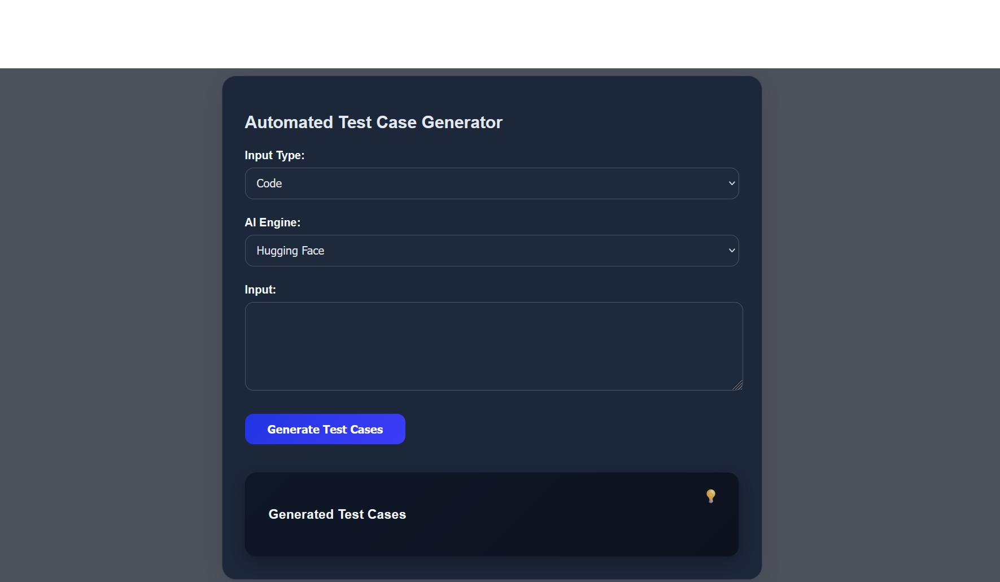

# Automated Test Case Generation App

Automatically generate software test cases from requirements or source code using AI. This app is designed to simplify the testing process and improve efficiency in software development.

## 🚀 Features

- ✅ Generate test cases from raw requirements or code
- ⚙️ Intelligent analysis using a Hugging Face model
- 📦 React-based frontend for a clean, user-friendly interface
- 🚀 FastAPI backend for fast and scalable processing
- 📊 Handles large inputs by intelligently chunking them
- 💾 Downloads and reuses the model locally after the first use

## 🛠️ Tech Stack

- **Frontend**: React.js
- **Backend**: FastAPI (Python)
- **AI Model**: Hugging Face transformer

2. Setup Backend (FastAPI)
cd server
python -m venv venv
source venv/bin/activate  # or venv\Scripts\activate on Windows
pip install -r requirements.txt
uvicorn main:app --reload

4. Setup Frontend (React)
cd frontend
npm install
npm start

🔧 Usage
- Open the app in your browser.
- Enter software requirements or code.
- Click "Generate Test Cases."
- View or copy the generated test cases for use in your test suite.

📸 Screenshots

  
